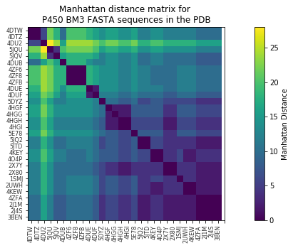
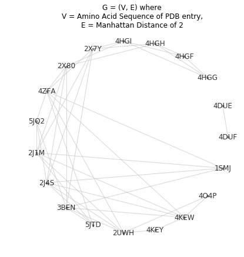
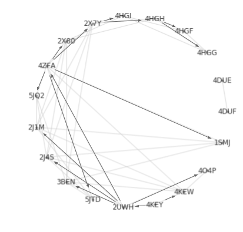

## Using a shortest path search to design mutagenic primers

Some time ago, I was planning some experiments to correlate chemical activity with the 3D structure of a few P450 BM3 mutants. T
here are about 70 BM3 structures on the PDB, but I was only interested in the substrate-bound ones, since this enzyme changes
shape quite a lot when it binds to a substrate and I wanted to cut down the search space a little. 

The notebook is pretty messy so here's a breakdown of what I did:
#### 1 Preprocecessing
First I took the FASTA-format sequences and used [clusta omega](https://www.ebi.ac.uk/Tools/msa/clustalo/) to do a multiple sequence alignment. After this I wanted to quantify the 'mutation distance' between each sequence, so I turned each letter to a number using [scikit learn's one-hot encoder](https://scikit-learn.org/stable/modules/generated/sklearn.preprocessing.OneHotEncoder.html) which is a common way to handle categorical variables.

#### 2 Pairwise distance
I wanted to map which sequences were one mutation away from another, so I started by generating a [Manhattan distance](https://en.wikipedia.org/wiki/Taxicab_geometry) matrix, where 2 units is one mutation. 

I used this to make myself a graph, where edges are between sequences with only one substitution

##### 3 Shortest path search!
This is an exciting bit, I started at 4KEY, which is the structure code for the A82F/F87V mutant of P450 BM3. I have the [plasmid](https://en.wikipedia.org/wiki/Plasmid) containing this gene handy in the lab. I was opting for [site-directed mutagenesis](https://en.wikipedia.org/wiki/Site-directed_mutagenesis) to make my mutants  because it's cheap.

I used the [networkx](https://networkx.github.io/) function networkx.algorithms.shortest_paths.generic.shortest_path, which uses Dijkstra's search as a default. Now I had the shortest path from my mutant in the lab to some (but not all) of the P450s in the set. I never ended up making these, but it was a nice excuse to use Dijkstra in my work!

#### 4 
At this stage I was in overkill mode, and tried to make an automated [primer](https://www.nature.com/scitable/definition/primer-305) design system. This code is a mess too so I'll talk you through what was in my head. LAter.
